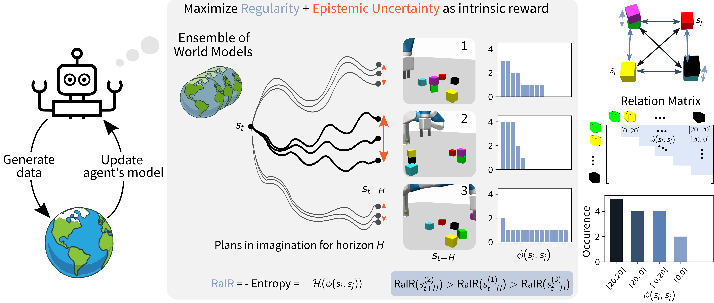

# Regularity as Intrinsic Reward for Free Play

<p align="middle">

</p>

This repository contains the code release for the paper [Regularity as Intrinsic Reward for Free Play](https://openreview.net/forum?id=BHHrX3CRE1) by Cansu Sancaktar, Justus Piater, and Georg Martius, published as a poster at [*NeurIPS 2023*](https://neurips.cc/virtual/2023/poster/72493). Please use the [provided citation](#citation) when making use of our code or ideas.

- Webpage: https://sites.google.com/view/rair-project
- Arxiv:  https://arxiv.org/abs/2312.01473
- OpenReview: https://openreview.net/forum?id=BHHrX3CRE1

The MBRL framework is the same as in the repository of [CEE-US](https://github.com/martius-lab/cee-us).

**Pre-NeurIPS Release** Note that the installation and some changes post refactoring haven't been tested as rigorously as I would have liked. Be on the lookout for updates post-NeurIPS, and if you see anything, feel free to open up an issue, I'm happy to help out :) 

## Installation

1. Install and activate a new python3.8 virtualenv.
```bash
virtualenv mbrl_venv --python=python3.8
```

```bash
source mbrl_venv/bin/activate
```

For the following steps, make sure you are sourced inside the `mbrl_venv` virtualenv.

2. Install torch with CUDA. Here is an example for CUDA version 11.8.
```bash
pip3 install torch==2.0.1+cu118 torchvision==0.15.2+cu118 --extra-index-url https://download.pytorch.org/whl/cu118
```

You can change the CUDA version according to your system requirements, however we only tested for the versions specified here. 

3. Prepare for [mujoco-py](https://github.com/openai/mujoco-py) installation.
    1. Download [mujoco200](https://www.roboti.us/index.html)
    2. `cd ~`
    3. `mkdir .mujoco`
    4. Move mujoco200 folder to `.mujoco`
    5. Move mujoco license key `mjkey.txt` to `~/.mujoco/mjkey.txt`
    6. Set LD_LIBRARY_PATH (add to your .bashrc (or .zshrc) ):
    
    `export LD_LIBRARY_PATH="$LD_LIBRARY_PATH:$HOME/.mujoco/mujoco200_linux/bin"`

    7. For Ubuntu, run:
    
    `sudo apt install libosmesa6-dev libgl1-mesa-glx libglfw3`
    
    `sudo apt install -y patchelf`

4. Install supporting packages
```bash
pip3 install -r requirements.txt
```

5. From the project root:
```bash
pip install -e .
```

6. Set PYTHONPATH:
```bash
export PYTHONPATH="$PYTHONPATH:<path/to/repository>"
```

Note: These settings have only been tested on Ubuntu 20. It is recommended to use Ubuntu 20. 

## How to run

Our proposed regularity reward RaIR can be found in [`mbrl/rair_utils.py`](./mbrl/rair_utils.py).

We have two sets of experiments: 1) with ground truth models where we use the simulator itself as model, 2) with learned models where we inject RaIR into free play.

### RaIR with GT models
For RaIR ground truth experiments in envs = {ShapeGridWorld, Construction, Quadruped, Walker}, run: 

```bash
python mbrl/main.py experiments/rair/settings/[env]/gt_model/[settings_file].yaml
```

E.g. for the Construction run, the settings for relational RaIR with absolute difference (default mode in our work) are specified in: [`construction_gt_rair.yaml`](./experiments/rair/settings/construction/gt_model/construction_gt_rair.yaml)

- [`construction_gt_direct_rair.yaml`](./experiments/rair/settings/construction/gt_model/construction_gt_direct_rair.yaml): Settings for RaIR of order 1
- [`construction_gt_distance_rair.yaml`](./experiments/rair/settings/construction/gt_model/construction_gt_distance_rair.yaml): Settings for relational RaIR with distance functions
- [`construction_gt_bzip2.yaml`](./experiments/rair/settings/construction/gt_model/construction_gt_bzip2.yaml): This is an additional experiment which we include in the Supplementary of our paper -- instead of entropy minimization, we use an off-the-shelf compression algorithm. Quite similar to direct RaIR. Doesn't work as well as RaIR, especially with more objects, but still fun :D

Check [`shape_gridworld`](./experiments/rair/settings/shape_gridworld/gt_model) and [`roboyoga`](./experiments/rair/settings/roboyoga/gt_model) for RaIR in ShapeGridWorld and Quadruped & Walker (Roboyoga).

Using the scripts in [`plotting`](./plotting), e.g. [`plotting/replay_construction_job.py`](./plotting/replay_construction_job.py), you can replay the generated rollouts and record videos, or also save images. Just specify the `run_name` and `mode` inside the script.

### RaIR in Free Play
To run RaIR + CEE-US in e.g. Construction run:

```bash
python mbrl/main.py experiments/rair/settings/construction/curious_exploration/gnn_ensemble_rair_cee_us.yaml
```

In general, all settings files are stored in the experiments folder. Parameters for models, environments, controllers, free play vs. zero-shot downstream task generalization are all specified in these files. In the corresponding folders (e.g. [`curious_exploration`](./experiments/rair/settings/construction/curious_exploration)), you will also find the settings files for the following baselines:

- [`gnn_ensemble_cee_us.yaml`](./experiments/rair/settings/construction/curious_exploration/gnn_ensemble_cee_us.yaml): Settings for CEE-US run (just ensemble disagreement as intrinsic reward)
- [`baseline_rnd_icem_gnn_ensemble.yaml`](./experiments/rair/settings/construction/curious_exploration/baseline_rnd_icem_gnn_ensemble.yaml): Settings for Random Network Distillation (RND) baseline, from [Burda et al., 2019](https://openreview.net/forum?id=H1lJJnR5Ym). Instead of training an exploration policy like in the original work, we use the model-based planning backbone from CEE-US (ensemble of structured world models + planning for future intrinsic reward with iCEM, horizon 20).
- [`baseline_dis_icem_gnn_ensemble.yaml`](./experiments/rair/settings/construction/curious_exploration/baseline_dis_icem_gnn_ensemble.yaml): Settings for Disagreement (Dis) baseline, from [Pathak et al., 2019](https://proceedings.mlr.press/v97/pathak19a.html). Instead of using one-step disagreement with an exploration policy, we use the model-based planning backbone from CEE-US, however this time only with horizon 1.

Analogously, for RaIR+CEE-US in Quadruped run:
```bash
python mbrl/main.py experiments/rair/settings/roboyoga/curious_exploration/mlp_ensemble_rair_cee_us.yaml
```

We also include one free play run with RaIR+CEE-US in [`Construction`](./trained_models/construction_free_play) and [`Quadruped`](./trained_models/quadruped_free_play). The data generated during the rollouts can be downloaded [here](https://drive.google.com/drive/folders/185I9IhcTQRIDnVg0g6h49SxHiYzMhEAf?usp=sharing).

### Zero-shot Downstream Task Generalization After Free Play
For the extrinsic phase, use the scripts in the `experiments/rair/settings/[env]/zero_shot_generalization` folders. E.g. to test stacking with world models learned in a RaIR+CEE-US free play run:

```bash
python mbrl/main.py experiments/rair/settings/construction/zero_shot_generalization/construction_zero_shot_stack.yaml
```
Inside these settings files, you can specify the path to the model that you would like to test and also modify the number of objects for the downstream task.

For Quadruped, we include the zero-shot tasks for the [Roboyoga](https://github.com/orybkin/lexa-benchmark) benchmark: [`quadruped_roboyoga.yaml`](./experiments/rair/settings/roboyoga/zero_shot_generalization/quadruped_roboyoga.yaml). We also include a walk task: [`quadruped_walk.yaml`](./experiments/rair/settings/roboyoga/zero_shot_generalization/quadruped_walk.yaml).

## Code style
Run to set up the git hook scripts
```bash
pre-commit install
```

This command will install a number of git hooks that will check your code quality before you can commit.

The main configuration file is located in

`/.pre-commit-config`

Individual config files for the different hooks are located in the base directory of the rep. For instance, the configuration file of `flake8` is `/.flake8`.  


## Citation 

Please use the following bibtex entry to cite us:

    @inproceedings{sancaktar2023regularity,
      author={Cansu Sancaktar and Justus Piater and Georg Martius},
      title = {Regularity as Intrinsic Reward for Free Play},
      booktitle = {Advances in Neural Information Processing Systems 37 (NeurIPS 2023)},
      year = {2023},
      url={https://openreview.net/forum?id=BHHrX3CRE1}
    }


## Credits
The MBRL framework and the bulk of the code is from the repository of [CEE-US](https://github.com/martius-lab/cee-us).
As a new environment ShapeGridWorld is added, which is modified from the [C-SWM](https://github.com/tkipf/c-swm) repository by Thomas Kipf, which is under MIT license.
